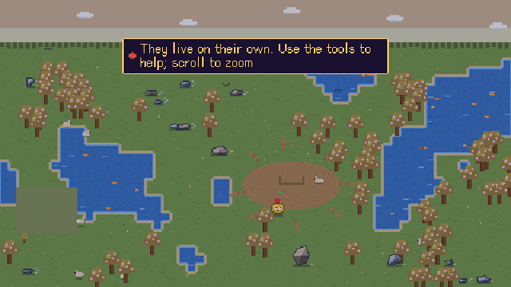
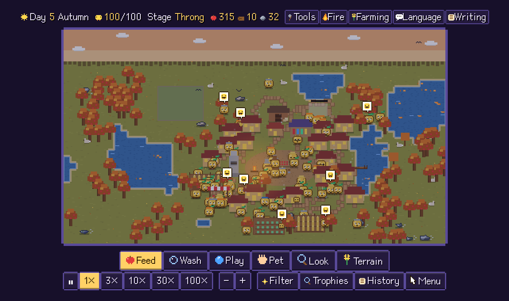
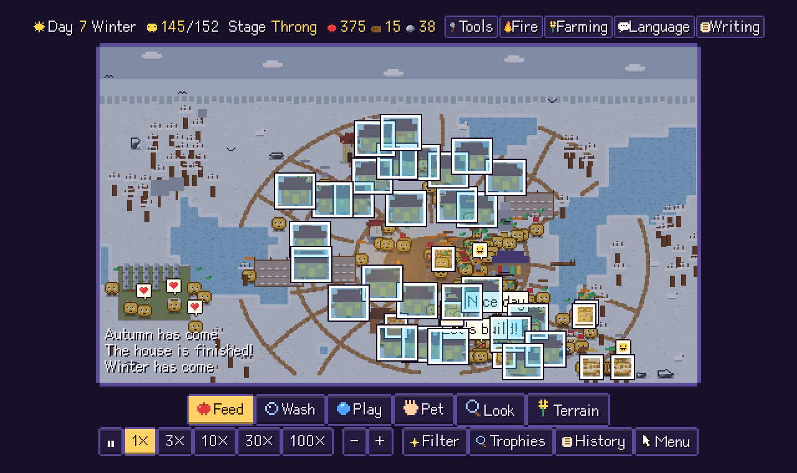
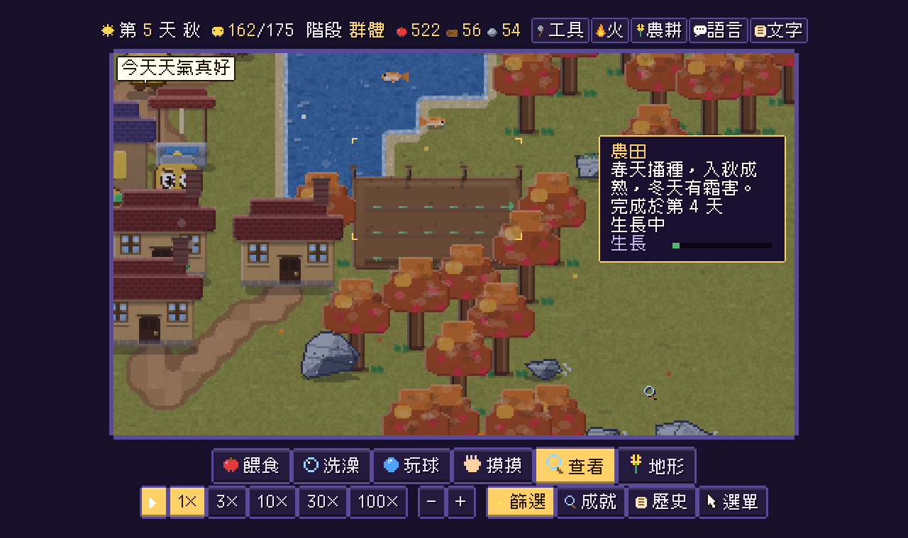
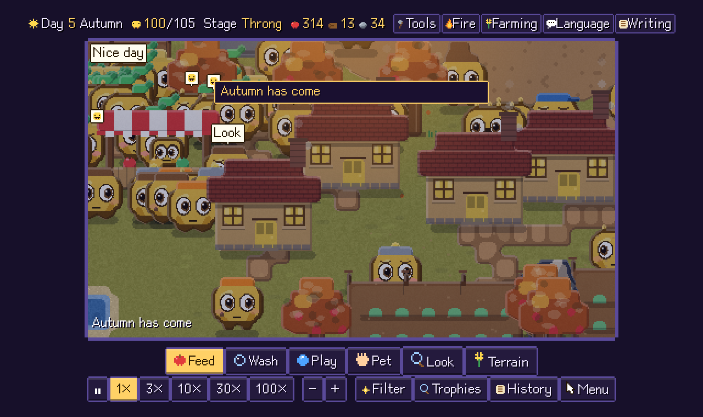

# 🐥 Swarmlings

**English** ・ [繁體中文](README.zh-TW.md)

**▶ Play in your browser: https://shanchiehchiu.github.io/swarmlings/**

A pixel-art virtual-pet game that quietly turns into a civilization simulator. You find one fuzzy creature in a meadow. There is plenty of fruit and water, so it lives on its own — and multiplies. Feed, wash, play with and pet them if you like, or just watch. Give them time and they build roads, houses, farms, a market and a dock, discover fire and writing, raise generations, bury their elders… and finally raise a monument, **wake up, and start watching you**.

Single HTML file, zero dependencies, no build step. Open `index.html` and play. UI in English and Traditional Chinese (auto-detected, switch in the menu).



_A single creature becomes a village in about 12 seconds of time-lapse, then the camera zooms in (level-of-detail switches to finer art)._



| | |
|---|---|
|  |  |
|  | Zoomed in 4×: shingled roofs, window frames, chimneys and detailed faces — the art gets *finer*, not just bigger. |

## What is in it

- **Hands-off by default.** They eat fruit, bathe, chat and reproduce without you. Your care is a bonus, not a requirement.
- **Procedural worlds.** Every game has a different map (lakes, forests, rocks, three palettes). Share one with `?seed=26`.
- **A planned settlement.** Roads are not planned: whenever a building is finished, a lowest-cost path (Dijkstra) is walked from its door to the nearest road or the plaza, detouring around lakes, trees, rocks and other houses and preferring existing roads — so branching, merging, winding paths emerge on their own. New houses prefer spots along existing roads or next to other houses. Landmarks ring the plaza, farms and mills sit on the outskirts, docks on the shore. Landmarks sit near the plaza, farms on the outskirts, docks on the shore.
- **Seasons.** Spring blossoms, summer green, autumn leaves, winter snow and frozen lakes. Water level rises and falls with the seasons.
- **Food-limited growth.** When the stockpile runs low, births pause and the population eases back as elders pass on, instead of starving in droves. Farms scale with population (up to 12) and saplings spread faster in big towns.
- **Farming that works.** Crops are sown in spring, ripen in autumn, frost in winter.
- **Buildings and jobs.** Huts, houses, campfire, farm, library, monument, well, storehouse, mill, market, dock — plus farmers and fishers.
- **Generations.** Parents, children, elders with white hair, gravestones in a graveyard, funerals.
- **Events.** Droughts, bountiful harvests, meteor showers, auroras, festivals.
- **Wildlife.** Fish in the lakes, birds in the sky, rabbits that hop away from you.
- **Inspect anything.** Click a creature, building, tree, rock, grave or animal for an info card. A **Filter** panel outlines every match (e.g. all farmers, all ripe farms).
- **World history.** A timeline of everything important that happened, with stats.
- **Terrain tool.** Plant trees, place rocks, dig ponds, fill water.
- **Achievements & records** saved in your browser, plus nine different endings.
- **Sound.** Rain, wind, birds, crickets and a seasonal pentatonic melody, all synthesized live with WebAudio (no audio files).
- **Level of detail, in pixels.** Zoom in and the art gets *finer*, not just bigger: the canvas switches to 2× / 4× internal resolution, sprites are redrawn with a Scale2x pass (rounded corners) plus rim light, shading and grain, and the ground and roads get the same treatment (fine grain, tufts of grass, pebbles). Creature faces are redrawn at sub-pixel resolution — outlined eyes with iris, pupil and a catch-light that follow your mouse when they are watching, brows, blush, and a mouth that curves with their mood. Rocks are re-rasterised at the finer grid (six-step shading, strata, cracks, moss or snow caps), water gets drifting wave lines, glints and shore foam, fish have scales and fins, rabbits have fur, ears and cotton tails, birds flap, and farm plants grow leaf by leaf into golden ears of grain. Season changes still cross-fade at any zoom. Zoom out with a really big crowd (roughly 250+ creatures on screen) and it falls back to simplified but shaded sprites — striped farms, two-tone roofs, a role-coloured dot per creature; normal full-map views stay at the standard level. Force a level in the Menu (Detail: Auto / Far / Normal / Near / Close-up).
- **Zoom & pan** with the wheel, right-drag, pinch or keyboard. Time speeds up to 100×.
- **Everything is pixel art**, including the UI, drawn in code (only external asset: a pixel font, see below).

## Controls

| | |
|---|---|
| `1`–`6` | Feed · Wash · Play · Pet · Look · Terrain |
| `F` / `H` | Filter panel / World history |
| `Space` | Pause |
| Wheel, `+` `-`, `0` | Zoom in / out / reset |
| Right-drag, arrows, WASD | Pan |
| Menu | Music, sound, language, reset |

URL parameters: `?lang=en` · `&seed=26` · `&speed=30` · `&intro=0`

## Run locally

```
open index.html      # macOS; or just double-click the file
```

## Credits & notes

- All art, dialogue, questions and endings are original and drawn/written in code.
- Inspired by the fictional virtual-pet game in *Black Mirror* S7 "Plaything" (care → reproduce → emergent society → they start watching you). **This project is not affiliated with that show or its makers.**
- Font: [Cubic 11](https://github.com/ACh-K/Cubic-11) (SIL OFL 1.1, `tools/Cubic11-OFL.txt`). The 2.8 MB font is subset to the glyphs the game uses (~40 KB) by `tools/build-font.py` and embedded as base64 so the game stays a single offline file. After changing game text, rebuild with:

```
python3 -m venv .venv && .venv/bin/pip install fonttools brotli
.venv/bin/python tools/build-font.py
```

## License

Code: MIT (see `LICENSE`). Font: SIL OFL 1.1.
